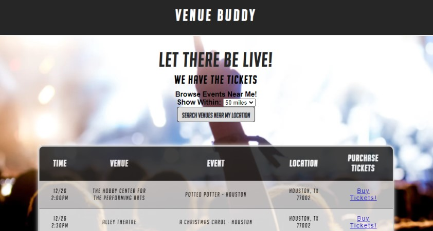

<<<<<<< HEAD
# Venue Buddy

Our team loves live music and events. Now that these events are happening again, we thought it would be fun to build an application that shows events happening near you!

Check it out and find yourself a Venue nearby! <url>
=======
# API-group-assignment

For our project, our team created Venue Buddy. The application utilizes a google location API to find the users location and then accesses the SeatGeek API to show the user events in their area.

We have not yet developed localStorage utilization. We plan to add the ability to add an address field and then allow the user to save their location.

The application is deployed here:   https://michaelcmaresco.github.io/Venue-Buddy/

>>>>>>> c332e2a79c0daa96a43c7fcfc43fd26fb1c5231d

